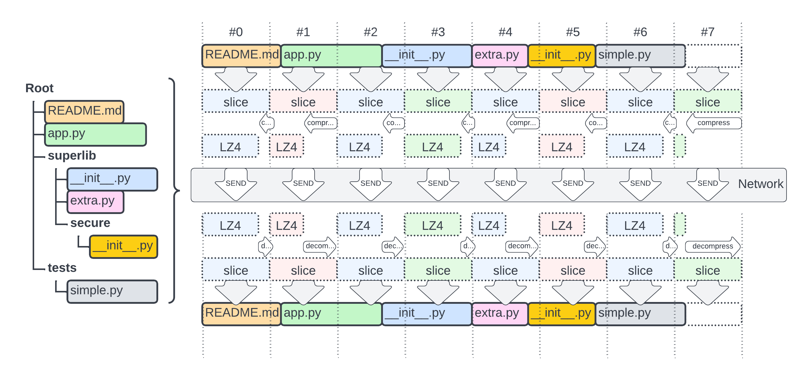

# tar-like



Folder transfer in tar like fashion. It consists of few components that let the process by streamlined.

* __index phase__ create an index of files to be transfered, capturing their `path`, `size` and `hash` (`md5`)
* __proxy__ the receiving end which has the DB created above at hand
* __upload__ the sending end  which also has the DB created above at hand
* __check__ optional tool that verifies that the files matches the hash in the DB

The whole process creates virtual `tar` like file inside the DB, which is for now just a simple concatenation of files.
In particular it just computes the position of each file within the concatenated file (`offset` and `offset_end`).
This virtual `tar` file - `SQLite` database is then shared between the sender and receiver.
The final step is to start a `tar_like.proxy` on the receiving end and `tar_like.upload` on sending site.
The sender `tar_like.upload` collects the files into a `segment` in memory (of certain arbitrary __block_size__ i.e. 10'000'000 = 10MB)
this segment is then __compressed__ using `LZ4` and using `PUT` method uploaded to `tar_like.proxy` which as it knows the
structure and from the __URL__ provided looks up the segment index, and after decompression it split the block segments back into files.

> Note: the segments are of a fixed size, however as the structure of segment is pulled from DB dynamically it can accomodate. 
> In addition the size of a segment is part of the __URL__.

It is __expected__ that the files __do not change__ during the upload. Otherwise the hashes will not match. As such it is not a problem you can retry, but the delta transfer of not yet considered and/or developed (~_new index,delta computation, new upload, resize or delete files as needed_).

## Index

An example how to make an index of this folder:

```bash
python -mtar_like.index -x .git -x __pycache__ -x tmp/ -c
```

or dockerized [`./r01-index.sh`](r01-index.sh)


* `-x` exclude of some regex pattern matched against the filepath
* `-c` clean db before inserting values

To check the resulting sqlite DB:

```bash
sqlite3 ~/.tar_like.sqlite '.mode table' 'SELECT * FROM tar LIMIT 40;'
```

## Proxy

On the receiving end run:

```bash
python -mtar_like.proxy
```

or dockerized [`./r02-proxy.sh`](r02-proxy.sh)

## Upload

On the sending end run:

```bash
python -mtar_like.upload -f 0 -s 100000
```

or dockerized [`./r03-upload.sh`](r03-upload.sh)

where:

* `-f 0` is the number of first block to send
* `-s 100000` is the size of block in bytes

## Check

To check the checksums of files on filesystem vs in the DB

```bash
python -mtar_like.check
```

or dockerized [`./r04_check.sh`](r04_check.sh)
